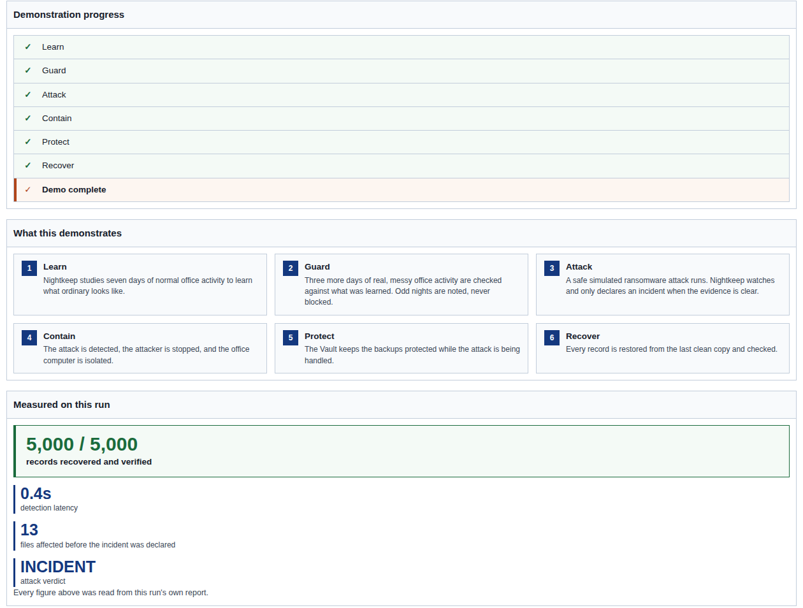
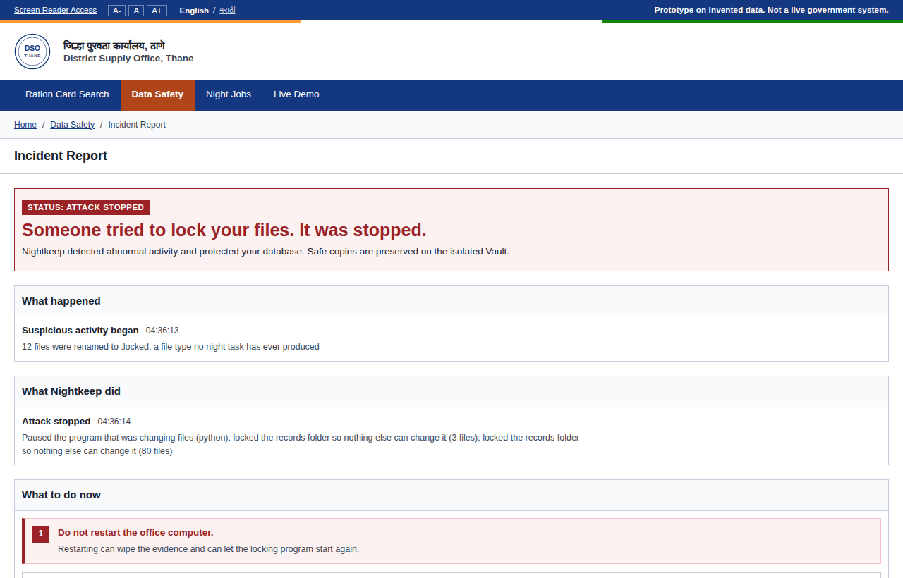
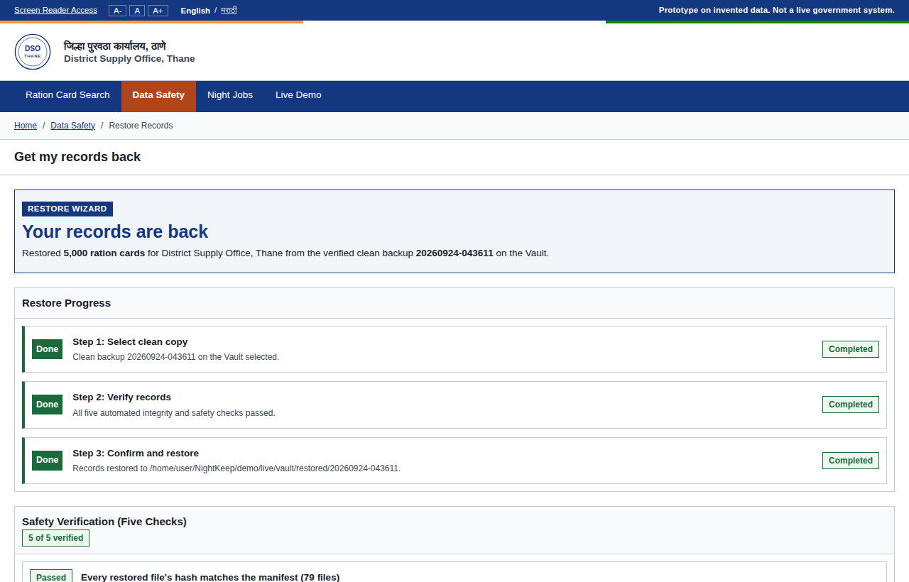
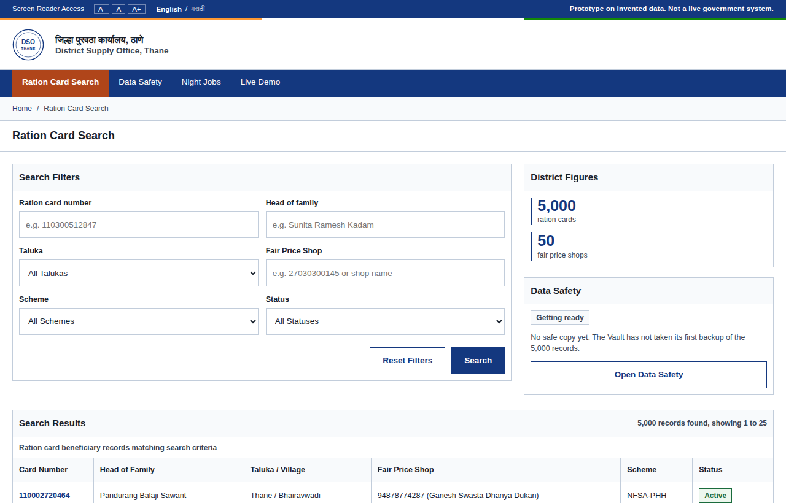
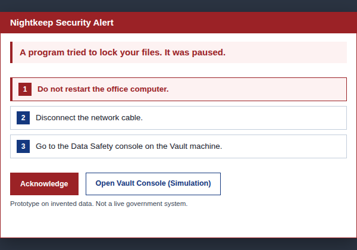

<div align="center">

# Nightkeep

### Learns the chaos. Catches the crime.

Ransomware defence for a district ration office server whose night jobs look like ransomware.

[](https://github.com/Kirito0088/NightKeep/actions/workflows/ci.yml)
[](https://www.python.org/downloads/release/python-3110/)
[](docs/demo-runbook.md)
[](LICENSE)

**MUSA CodeX 2026** · Problem statement **CX0204 "Threat at the Ration Shop"** · **Team CodeRed**

[Quickstart](#quickstart) · [Live Demo](#run-the-live-demo) · [How it works](#how-it-works) · [Proofs](#what-it-proves) · [Docs](#documentation)



</div>

> **Prototype on invented data. Not a live government system.** No real
> personal data appears anywhere, and no Aadhaar-shaped numbers are ever
> generated.

---

## The problem

A district Public Distribution System (PDS) server runs old, undocumented jobs
every night. At 2 am they zip, rename and delete thousands of files in
seconds. To an ordinary security tool that looks exactly like ransomware, so
it either cries wolf every night or gets switched off.

**Nightkeep learns what each night job normally does, ignores the weirdness,
and still catches a real attack within seconds.** It pauses the attacker,
locks the records, keeps the backups safe on a machine the attacker can't
reach, and restores all 5,000 ration cards with proof that every one is
readable.

Everything runs offline on an ordinary laptop. No cloud, no GPU, no deep
learning.

## Highlights

- **Learns the office's habits.** Seven days of watching the six real,
  messy night jobs. After that, an odd night is noted, never blocked.
- **Fixed tripwires catch the attack.** Decoy files, scrambled content,
  mass renames to a new file type, and recovery-killing commands. These
  are hard-coded rules that learning can never loosen.
- **Stops it in about a second.** The attacking program is paused and the
  records folder is made read-only. The office computer shows a native
  Windows warning pop-up.
- **A backup the attacker can't reach.** The Vault pulls from the server,
  never the other way round. The server holds no path, password or address
  for it.
- **Recovery with proof.** Five checks run on every restore, ending with
  "all 5,000 ration cards are present and readable".
- **Written for the counter clerk.** Screens use plain words like "Your
  records are safe", and every technical detail sits behind a
  "For the IT person" link. English and Marathi.

## What it proves

Four proofs, each measured on a real run, not claimed. The numbers below
come from one seeded 5,000-card run on the Windows demo machine
(`python -m nightkeep --demo-run`). Your run prints its own.

| # | Proof | Result on the reference run |
|---|---|---|
| **P1** | Messy legacy jobs raise **no** false alarms | 6 erratic jobs over 7 learning + 3 guard nights: **0** incidents. One deliberately unusual night reads as a harmless **ODD** |
| **P2** | A ransomware attack **is** caught fast and stopped | Incident after **13** files, in **2.1 s** (target: under 50 files, under 10 s) |
| **P3** | The backup **survives** | The scrambled copy is marked **SUSPECT**. The last clean copy stays **pinned** |
| **P4** | Recovery is **proven**, not assumed | **5,000 / 5,000** ration cards verified from the clean copy, all five checks passed |

## Screenshots

<table>
  <tr>
    <td width="50%"></td>
    <td width="50%"></td>
  </tr>
  <tr>
    <td align="center"><b>Incident Report</b>, in ration-office units</td>
    <td align="center"><b>Get my records back</b>, three steps and five checks</td>
  </tr>
  <tr>
    <td width="50%"></td>
    <td width="50%"></td>
  </tr>
  <tr>
    <td align="center"><b>Ration card search</b>, the PDS system being protected</td>
    <td align="center"><b>The office pop-up</b>, what happened and three steps</td>
  </tr>
</table>

## Quickstart

### Requirements

- **Windows 10 or 11.** Two of the six night jobs are a `.bat` and a `.vbs`
  script that run under `cmd.exe` and `cscript.exe`, exactly like the real
  legacy jobs. On Linux or macOS the console opens, but the night jobs
  can't run.
- **Python 3.11** (3.12+ is not supported).

### Install

```bash
git clone https://github.com/Kirito0088/NightKeep.git
cd NightKeep
python -m pip install -e ".[dev]"
```

### Run the live demo

```bash
python -m nightkeep --console
```

Open <http://127.0.0.1:5000>, click the **Live Demo** tab, then
**Start guided demo**.

The whole story then plays by itself in about two minutes: 7 learning days
and 3 guard days at 10 seconds each, then a safe simulated attack, the pop-up,
the lock, the Vault check and the restore. Every screen follows the same run.

The console listens on `127.0.0.1` only, never on the network.

### Run the one-shot proof

```bash
python -m nightkeep --demo-run --variant fast
```

This prints the four proofs in the terminal and writes the full report to
`demo/demo_run/district/reports/demo_run.json`. Variants:

| Variant | What the safe simulator does |
|---|---|
| `fast` | Locks files as fast as it can |
| `impersonator` | Scrambles files in place while posing as a known night job |
| `recovery-killer` | Also shows backup-deleting command text (only ever echoed, never run) |

## Using the console

| Where | What you can do |
|---|---|
| **Live Demo** → **Start guided demo** | Restarts the session and runs the full story on autopilot |
| **Live Demo** → **Step-by-step controls** | Pick a simulator variant and **Launch simulated attack** (unlocks after day 1). Switch **Harvest surge** on. **Restart from day 1** |
| **Data Safety** → **Get my records back** | Restore after an attack. Supervisor PIN `246810` in the demo (`console.supervisor_pin` in `nightkeep/config.yaml`) |
| **Night Jobs** | Each job's learning status, its usual pattern, its last run and how that run was judged |
| **A-, A, A+** and **English / मराठी** | Text size and language, in the top strip |

**Supervisor PIN for the demo: `246810`.** The Vault asks for it before a
restore. It is set as `supervisor_pin` in `nightkeep/config.yaml` and is read
once at startup, so restart the console after changing it.

Want more time on each day? `python -m nightkeep --console --day-seconds 30`

<details>
<summary><b>All console routes</b></summary>

| Route | Screen |
|---|---|
| `/` or `/search` | Ration card search (the PDS system) |
| `/card/<card_no>` | Card detail: members, entitlements, ePoS history |
| `/locked` | The search screen during an incident (labelled "DEMONSTRATION DRILL" until a real one) |
| `/safety` | Data Safety home: "am I okay?" and the six night tasks |
| `/night-jobs` | Night Jobs: learning status, usual pattern and last check for each job |
| `/alert` | The Incident Report ("STATUS: ALL CLEAR" when nothing happened) |
| `/restore` | The three-step restore wizard with its five checks |
| `/server-alert` | The pop-up shown on the office computer |
| `/showcase` | Live Demo: the guided demo plus the step-by-step controls |
| `/it-view` | Read-only IT diagnostics (incident, watcher, habits, Vault) |

</details>

<details>
<summary><b>More commands</b></summary>

**Prove the night jobs really are erratic** (a standalone report):

```bash
python -m nightkeep --prove-erratic
```

**Put a scrambled demo district back** with the known key (`simulator.key`
in `nightkeep/config.yaml`):

```bash
python -m nightkeep.simulator.decrypt --root demo/demo_run/district \
    --key "$KEY" --locked-extension .locked \
    --ransom-note-name HOW_TO_GET_YOUR_FILES_BACK.txt
```

**UI-only mode**, with sample records and no live session:

```bash
python -m nightkeep.console
```

</details>

## How it works

Nightkeep is split across two machines that share no stateful code and no
credentials.

```
 PDS server (Laptop A)                         Vault (Laptop B or a VM)
 ┌───────────────────────────────┐  read-only  ┌──────────────────────────────┐
 │ mock_pds: 5,000 cards, 6 jobs │◀─── PULL ───│ vault: content-addressed     │
 │        │                      │             │  blobs, hash-chained         │
 │        ▼                      │             │  manifests, health check,    │
 │ watcher ─▶ habit ─▶ judge     │── status ──▶│  pinned clean points, verify │
 │ pause / read-only, reversible │  (pulled)   │ console: the screens         │
 └───────────────────────────────┘             └──────────────────────────────┘
   The Vault always opens the connection. The PDS server holds no path,
   credential or address for it, so an attacker on the server has nothing to follow.
```

1. **Watcher** records every file change on the server and which program made it.
2. **Habit** learns each night job's normal pattern (start time, files
   touched, file types) using medians and spreads, then scores each new run.
3. **Judge** combines the habit score with six fixed signals. The habit
   score alone can only say ODD. An INCIDENT always needs a fixed tripwire.
   On INCIDENT it pauses the program and makes the records read-only, and
   both steps can be undone.
4. **Vault** pulls a copy every night, checks its health, pins the last
   clean copy, and watches the watcher's heartbeat. If the watcher goes
   silent, the Vault protects the backups by itself.
5. **Console** shows all of this in plain language on the Vault's screen.

### The three rules the code obeys

1. **The learned habit score never pauses, locks or deletes anything on its
   own.** Every INCIDENT needs at least one fixed tripwire or recovery signal.
2. **Tripwires are never learned.** Signals S2 to S7 are hard-coded rules,
   live from minute one. No learning path may widen them.
3. **The PDS server never gets a path, credential or address for the Vault.**

Each rule has a test that fails if the rule is broken.

### The attack simulator is safe by design

- It refuses to run outside the repo's `demo/` folder and outside a real
  demo district.
- It is fully reversible. Files are XORed with a **known key**, and a
  matching script puts every byte back.
- It never runs a destructive command. The recovery-killer variant only
  **echoes** text like `vssadmin delete shadows` so signal S5 has something
  to read.
- It does not spread, and it has no path to the Vault.

## Tests

```bash
python -m pytest                 # everything (about 15 min, Windows)
python -m pytest -m "not slow"   # skip filesystem, subprocess and clock tests
```

## Project structure

```
nightkeep/
  mock_pds/     invented Thane district, 6 erratic night jobs, simulated clock
  watcher/      what changed on the PDS server, and which program did it
  habit/        what each night job normally does (learned)
  judge/        the six signals, the verdict table, reversible actions
  vault/        snapshots, hash chain, health check, verified restore
  console/      Flask app, Jinja templates, hand-written CSS
  simulator/    the safe ransomware simulator and its decrypt script
  live.py       the live session engine behind --console
  demo_run.py   the one-shot proof behind --demo-run
  config.yaml   every tunable number
  __main__.py   the entrypoint
docs/           MVP, solution design, ADRs, demo runbook
tests/          pytest suite
```

## Tech stack

Python 3.11 · `watchdog` · `psutil` · `numpy` / `pandas` · `sqlite3` ·
`PyYAML` · **Flask + Jinja + hand-written CSS** (no JavaScript framework, no
build step) · `pytest`

## Documentation

| Document | What's in it |
|---|---|
| [`docs/MVP.md`](docs/MVP.md) | The plan, the four proofs, the success metrics |
| [`docs/demo-runbook.md`](docs/demo-runbook.md) | Step-by-step Windows demo procedure |
| [`docs/adr/`](docs/adr) | Every settled design decision and why |
| [`CONTEXT.md`](CONTEXT.md) | The domain vocabulary |
| [`CLAUDE.md`](CLAUDE.md) | Architecture, the three rules, the stack |
| [`CONTRIBUTING.md`](CONTRIBUTING.md) | How to work in this repo |

### Operator notes

- **Signal S5 reads every shell on the machine.** It looks for text like
  `vssadmin delete shadows` in the command lines of shells and script hosts.
  During a demo, close unrelated terminals and don't type those strings.
- **Don't point `--console --out-dir` at `demo/demo_run/`.** The console
  wipes its own folder on start.

## Team

**Team CodeRed**, for MUSA CodeX 2026.

## License

[MIT](LICENSE) © Team CodeRed. Built on invented data.
